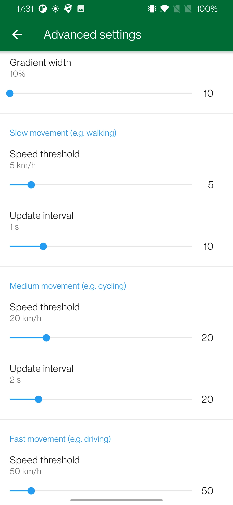
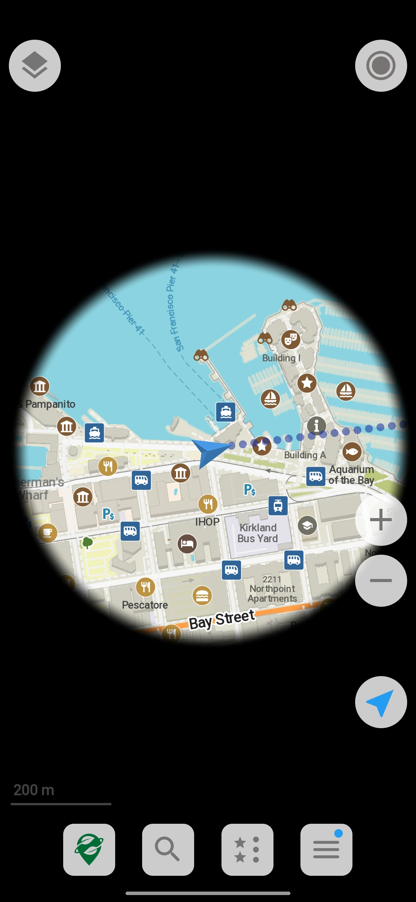
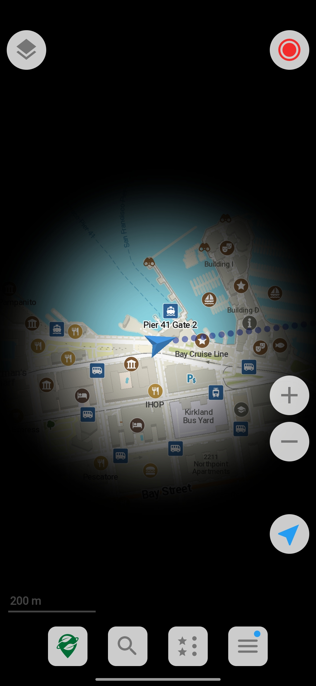

<div align="center">
  
</div>

<h1 align="center">🌫️ Organic Maps — Fog of War Edition</h1>

<p align="center">
  <b>Explore the real world like a video game.</b><br/>
  A fork of <a href="https://github.com/organicmaps/organicmaps">Organic Maps</a> that adds a <i>fog of war</i> overlay — the map is hidden until you physically visit a place.
</p>

---

## What is this?

This is a modified version of [Organic Maps](https://organicmaps.app) with a **fog of war** layer. Unexplored areas are covered by a dark overlay. As you walk, cycle, or drive through the world, the fog lifts along your path, revealing the map underneath — just like in a strategy game.

The fog is revealed by:
- **Your current GPS position** — a circle around you clears in real time
- **Imported GPX tracks** — load your past routes and watch the map light up

## Features

- 🗺️ **Fog of war overlay** rendered natively in the Drape engine (no performance hacks)
- 📍 **Real-time reveal** around your GPS position (throttled, smooth updates)
- 📂 **GPX track support** — import tracks to reveal previously visited areas
- 🔄 **Live fog updates** — fog clears as you move, with automatic track recording
- ✂️ **Track editor** — select a range on the elevation profile and delete it from the GPX file (Android). Long-press the chart to set the second point; the fog of war is automatically refreshed after editing.
- ⚙️ **Configurable settings:**
  - **Reveal radius** (50–2000 m)
  - **Fog opacity** (10–100%)
  - **Fog color** — full HSV color picker
  - **Gradient edge width** (1–100%) — controls how sharply the fog fades at the reveal boundary
  - **Advanced throttle table** — per-speed-tier update intervals (Slow / Medium / Medium-fast / Fast), fully configurable in km/h and ms

<p align="center">
  
  &nbsp;&nbsp;
  
  &nbsp;&nbsp;
  
</p>

### Gradient edge width

The gradient edge width controls how sharply the fog fades at the boundary of revealed areas. A narrow gradient gives hard, crisp edges; a wide gradient produces soft, feathered transitions.

<p align="center">
  
  &nbsp;&nbsp;
  
</p>
<p align="center">
  <em>Left: gradient width 10% (sharp edge) &nbsp;·&nbsp; Right: gradient width 90% (soft edge)</em>
</p>

## How it works

The fog is implemented as a second tile-rendering layer in the Drape graphics engine. Each 256×256 map tile gets a corresponding fog tile — a semi-transparent overlay filled with the fog color. Circular cutouts are drawn for GPS tracks and the current position, with anti-aliased edges for smooth transitions.

The fog renders **after** map labels and transit overlays, so it covers everything cleanly. Settings are persisted to `settings.ini` and take effect immediately.

For a deep dive into the architecture, see [`docs/FOG_OF_WAR_ARCHITECTURE.md`](docs/FOG_OF_WAR_ARCHITECTURE.md).

## Building

Follow the standard [Organic Maps build instructions](https://github.com/organicmaps/organicmaps/blob/master/docs/INSTALL.md).

Android F-Droid pre-releases from this fork use the package name `app.organicmaps.fogofwar` and a distinct launcher icon, so they can be installed alongside the upstream Organic Maps app.

```bash
git clone --recursive https://github.com/denlogv/organicmaps-fog-of-war.git
cd organicmaps-fog-of-war/android
./gradlew assembleWebDebug
```

## Credits

This project is a fork of [**Organic Maps**](https://organicmaps.app) — a free, open-source, privacy-focused offline maps app built by the community.

Organic Maps was created by the founders of MapsWithMe (MAPS.ME) and is powered by [OpenStreetMap](https://www.openstreetmap.org) data. All credit for the incredible map engine, rendering pipeline, and offline capabilities goes to the Organic Maps team and contributors.

**Support the original project:**
- 🌐 Website: [organicmaps.app](https://organicmaps.app)
- 💬 Telegram: [@OrganicMapsApp](https://t.me/OrganicMapsApp) (news) · [@OrganicMaps](https://t.me/OrganicMaps) (community)
- 💬 Matrix: [#organicmaps:matrix.org](https://matrix.to/#/#organicmaps:matrix.org)
- ❤️ Donate: [organicmaps.app/donate](https://organicmaps.app/donate)
- 📖 GitHub: [organicmaps/organicmaps](https://github.com/organicmaps/organicmaps)

## License

Licensed under the Apache License 2.0 — same as the original Organic Maps project. See [`LICENSE`](LICENSE).
